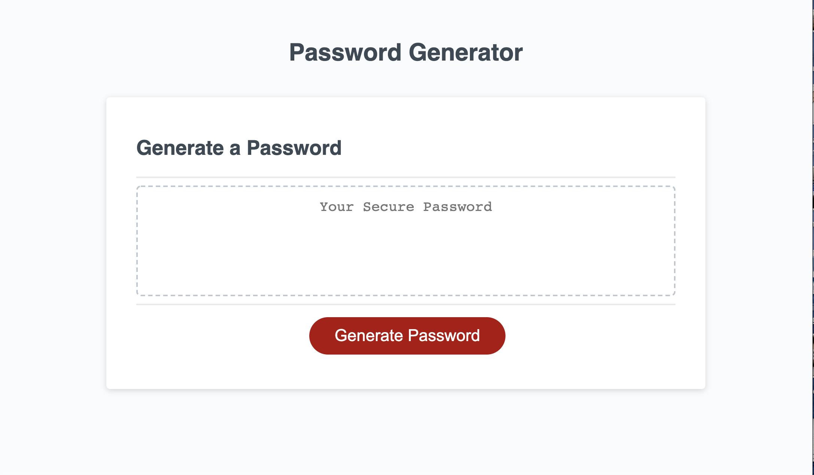
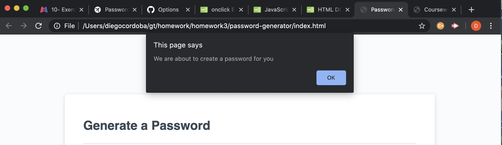
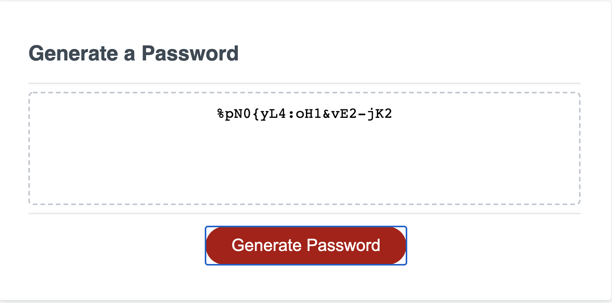

# password-generator
This password generator has been created to help users create passwords of differet lengths between 8 and 128 characters.  Customers can choose from a different set of characters such as numbers, upper and lower case letter, and special characters.

## Table of Contents 

* [Installation](#installation)
* [Usage](#usage)
* [Credits](#credits)
* [MIT License](#MIT-License)
* [Contributing](#Contributing)

## Installation

Clone repository on local machine and run HTML file in browser. After opening the app in the browser, click on generate password and follow the prompts at the top of the page.

## Usage 
The present application was made to help users create password of different lengths and characteristics without having to thin too much about how to get said random characters.

[Deployed Portafolio Site](https://diegocordoba87.github.io/password-generator/)

 

## Credits

This was a single project completed as homework for Georgia Tech Coding Boot Camp /FullStack Flex Program. With the help of instructors and classmates, I was able to create this password generator.

## MIT License

Copyright (c) [2020] [Diego Cordoba]

Permission is hereby granted, free of charge, to any person obtaining a copy
of this software and associated documentation files (the "Software"), to deal
in the Software without restriction, including without limitation the rights
to use, copy, modify, merge, publish, distribute, sublicense, and/or sell
copies of the Software, and to permit persons to whom the Software is
furnished to do so, subject to the following conditions:

The above copyright notice and this permission notice shall be included in all
copies or substantial portions of the Software.

THE SOFTWARE IS PROVIDED "AS IS", WITHOUT WARRANTY OF ANY KIND, EXPRESS OR
IMPLIED, INCLUDING BUT NOT LIMITED TO THE WARRANTIES OF MERCHANTABILITY,
FITNESS FOR A PARTICULAR PURPOSE AND NONINFRINGEMENT. IN NO EVENT SHALL THE
AUTHORS OR COPYRIGHT HOLDERS BE LIABLE FOR ANY CLAIM, DAMAGES OR OTHER
LIABILITY, WHETHER IN AN ACTION OF CONTRACT, TORT OR OTHERWISE, ARISING FROM,
OUT OF OR IN CONNECTION WITH THE SOFTWARE OR THE USE OR OTHER DEALINGS IN THE
SOFTWARE.
---

## Contributing

No contributions at this time. 